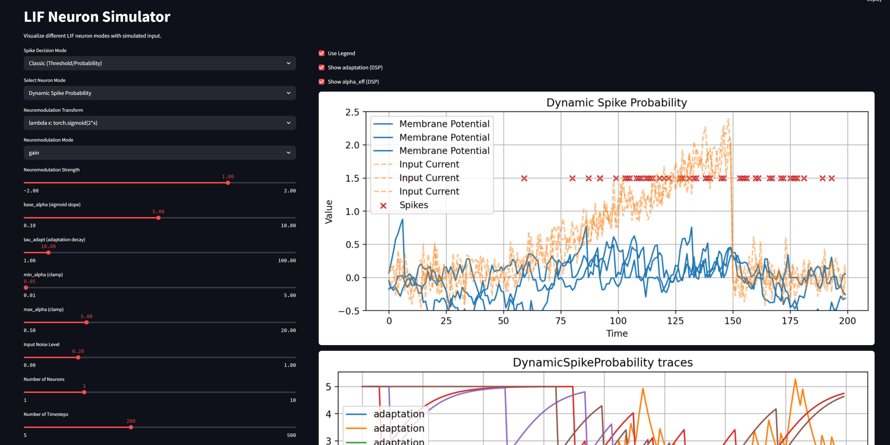
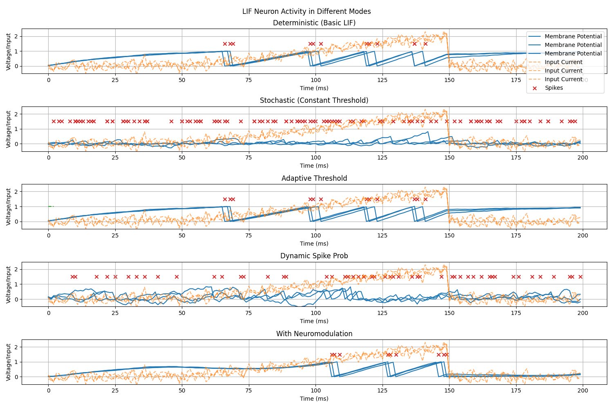
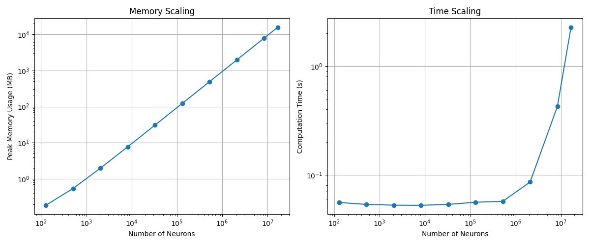

# QLIF Neurons

[](https://streamlit.io/)
[](https://pytorch.org/)
[](https://pennylane.ai/)
[](https://www.python.org/)
[](LICENSE)

### Development Notes

> I developed my own implementation of LIF neurons because
> existing libraries did not meet my specific requirements.
> I also implemented PyTorch-compatible qlif_layers for this QLIF neurons,
> enabling their integration into neural network models.

> Now with an streamlit dashboard for easy visualization and interaction!

```bash
streamlit run src/lif_streamlit_dashboard.py
```




---

## Overview

This repository features an advanced implementation of LIF neurons. Building upon the classic LIF model, it incorporates
dynamic spike probability, adaptive thresholds, synaptic short-term plasticity, neuromodulatory influences, and a hybrid quantum mode for spike generation using Qubits (via PennyLane).

Key features include:

- **Membrane Potential Tracking**: Detailed monitoring of voltage dynamics over time.
- **Spike Generation**: Realistic spike output using deterministic, stochastic, or quantum mechanisms.
- **Quantum LIF Mode**: Use quantum circuits (Qubits, RY gates, measurement) to probabilistically decide spiking, allowing simulation of quantum-inspired neuronal behavior.
- **Dynamic Adaptation**: Mechanisms that adjust neuron excitability based on recent activity.
- **Neuromodulation**: Integration of external signals (e.g., reward signals) to modulate firing behavior.
- **PyTorch Integration**: Fully PyTorch-compatible qlif_layers enable seamless incorporation into larger neural network
  architectures.

This framework not only allows for comprehensive simulations and comparisons of spiking behaviors across 
different neuron types but also facilitates the integration of biologically inspired and quantum-inspired 
dynamics into modern machine learning workflows.

### Key Features

| Feature                   | 	Description                                                             |
|---------------------------|--------------------------------------------------------------------------|
| Adaptive Threshold        | 	Threshold increases after spikes, preventing runaway firing             |
| Stochastic Dynamics       | 	Probabilistic spiking with noise injection                              |
| Synaptic Plasticity       | 	Short-term depression and recovery of synaptic efficacy                 |
| Neuromodulation           | 	External signals (e.g., simulated dopamine) modulate excitability       |
| Dynamic Spike Probability | 	Self-limiting spiking based on recent activity (homeostatic adaptation) |
| Quantum Mode              | 	Spike generation using quantum circuits (Qubits, RY gates, measurement, PennyLane) |

### Parameters

| Parameter	                           | Default	     | Description                                                                                                                                                                                           |
|--------------------------------------|--------------|-------------------------------------------------------------------------------------------------------------------------------------------------------------------------------------------------------|
| `num_neurons`	                       | `required`	  | Number of neurons in the group.                                                                                                                                                                       |
| `V_th`	                              | 1.0	         | Initial threshold voltage for all neurons.                                                                                                                                                            |
| ``V_reset``	                         | 0.0	         | Voltage to which the membrane potential is reset after a spike.                                                                                                                                       |
| ``tau``	                             | 20.0	        | Membrane time constant that controls the decay rate of the membrane potential.                                                                                                                        |
| ``dt``	                              | 1.0	         | Time step used for updating the membrane potential.                                                                                                                                                   |
| ``eta``	                             | 0.1	         | Adaptation rate for the threshold voltage (used in adaptive threshold updating).                                                                                                                      |
| ``use_adaptive_threshold``	          | True	        | If set to true, the threshold will adapt based on recent spiking activity.                                                                                                                            |
| ``noise_std``	                       | 0.1	         | Standard deviation of the Gaussian noise added to the membrane potential (used if stochastic firing is enabled).                                                                                      |
| ``stochastic``	                      | True	        | Enables stochastic firing. In stochastic mode, spikes are sampled based on a computed spike probability.                                                                                              |
| ``min_threshold``	                   | 0.5	         | Minimum allowable value for the threshold voltage.                                                                                                                                                    |
| ``max_threshold``	                   | 2.0	         | Maximum allowable value for the threshold voltage.                                                                                                                                                    |
| ``batch_size``	                      | 1	           | Batch size for input data processing.                                                                                                                                                                 |
| ``device``	                          | `cpu`	       | Device to run the simulation on (either `cpu` or `cuda`).                                                                                                                                             |
| ``surrogate_gradient_function``	     | `heaviside`	 | Name of the surrogate gradient function for backpropagation. Options include `heaviside`, `fast_sigmoid`, `gaussian`, and `arctan`.                                                                   |
| ``alpha``	                           | 1.0	         | Parameter for the surrogate gradient function.                                                                                                                                                        |
| ``allow_dynamic_spike_probability``	 | True	        | If true, enables dynamic spike probability computation that uses previous spike history (acts as a self-locking mechanism).                                                                           |
| ``base_alpha``	                      | 2.0	         | Base alpha value for the dynamic sigmoid function used in dynamic spike probability.                                                                                                                  |
| ``tau_adapt``	                       | 20.0	        | Time constant for the adaptation in the dynamic spike probability mechanism.                                                                                                                          |
| ``adaptation_decay``	                | 0.9	         | Decay rate for the adaptation current (how quickly the adaptation effect decays over time).                                                                                                           |
| ``spike_increase``	                  | 0.5	         | Increment added to the adaptation current each time a neuron spikes.                                                                                                                                  |
| ``depression_rate``	                 | 0.1	         | Rate at which synaptic efficiency is reduced (depressed) when a neuron spikes.                                                                                                                        |
| ``recovery_rate``	                   | 0.05	        | Rate at which synaptic efficiency recovers toward its baseline (typically 1) after being depressed.                                                                                                   |
| ``neuromod_transform``	              | None	        | A function or module that transforms an external modulation tensor (e.g. reward or error signal) into modulation factors (typically in [0, 1]). If None, a default sigmoid transformation is applied. |
| ``neuromod_mode``	                  | `gain`	      | Mode for neuromodulation. Options include `gain`, `prob_slope`, `threshold`, and (`off` or `None`).                                                                                                   |
| ``learnable_threshold``	             | `True`	      | If true, the threshold voltage is learnable and can be updated during training.                                                                                                                       |
| ``learnable_tau``	                    | `False`	     | If true, the membrane time constant tau is learnable and can be updated during training.                                                                                                              |
| ``learnable_eta``	                    | `False`	     | If true, the adaptation rate eta is learnable and can be updated during training.                                                                                                                     |
| ``learnable_qscale`` | `True`       | If true, the quantum scale factor (q_scale) is learnable and can be updated during training.                                                                                                          |
| ``learnable_qbias``  | `False`      | If true, the quantum bias (q_bias) is learnable and can be updated during training.                                                                                                                   |
| ``quantum_mode``	                  | `True`	      | If true, enables quantum mode for spike generation using PennyLane. In this mode, spikes are generated based on quantum circuit measurements (Qubits, RY gates).                                      |
| ``quantum_wire`` | 4            | Number of Qubits (wires) used per neuron (each neuron can use its own quantum circuit if desired).                                                                                                    |
| ``quantum_threshold`` | 0.7          | Quantum decision threshold (as cos(theta)): lower values = more selective, higher = more spikes.                                                                                                      |
| ``quantum_leak`` | 0.1          | Quantum leak, applied as an RY rotation after each update (emulates biological leak in quantum state).                                                                                                |

*All standard LIF parameters like V_th, tau, noise_std, etc. are still supported and work identically in quantum mode.*

### How It Works

#### Classic vs. Quantum Spike Generation

- **Classic Mode**: Spike is generated by crossing a voltage threshold, optionally with noise or adaptive dynamics.

- **Quantum Mode**: Each neuron's membrane potential is encoded as a quantum rotation (RY(V)), plus a "leak" rotation, and the spike is triggered if the measured Qubit is below a tunable quantum threshold.
This introduces a true quantum-inspired, probabilistic decision process.

#### Input Processing

- **I (Input Current):** The neuron receives a raw current, which is the primary drive.
- **External Modulation:** Optionally, an external signal (e.g., representing a reward or dopamine level) is provided.
  This signal is transformed (using a user-defined `neuromod_transform` or a default sigmoid) to produce a modulation
  factor that influences neuronal excitability.

#### Effective Input Calculation

The raw input is modified by internal dynamic factors:

- **Synaptic Efficiency:** Scales down the input if previous spikes have occurred (modeling synaptic depression).
- **Neuromodulator:** Adds a context-dependent boost (or reduction) to excitability.
- **Adaptation Current:** Subtracts from the input to account for refractory periods after spiking.

The effective input is computed as:

```math
I_{effective} = I * synaptic_{efficiency} + neuromodulator - adaptation_{current}
```

#### Membrane Potential Update

- The neuron's membrane potential ``V`` is updated based on the effective input, time constant tau, and any noise (if
  stochastic mode is enabled).
- When ``V`` exceeds the adaptive threshold ``V_th``, a spike is generated.
- In deterministic (non-stochastic) mode, a hard threshold is applied; in stochastic mode, a probability is computed (
  either static or dynamic) and a spike is sampled.

#### Spike Generation & Reset

- If a spike occurs, ``V`` is reset to ``V_reset``.
- The model then updates internal states:
- Adaptation Current: Increases for spiking neurons and decays over time.
- Synaptic Efficiency: Depresses upon spiking and recovers gradually.
- Adaptive Threshold (``V_th``): Adjusts (increases upon spiking and decays when inactive).

---

## Quantum Mode, Theory, Mapping & Calibration

This project includes a *qubit-based* spike generator for LIF neurons.  
The goal is to get a **differentiable, calibrated, and vectorized** probabilistic spike mechanism that can be trained end-to-end, while still being grounded in a simple quantum circuit.

### 1) One-Qubit Circuit (what we actually compute)

I use a single qubit with a rotation about the Y axis and measure `Z`:

```
prepare |0> --RY(θ)--> measure Z
```

The probability of measuring `|1>` is:

```
p(|1>) = sin²(θ / 2) = 0.5 * (1 - cos θ)
```

Then map the neuron's **membrane gap**:

```
Δ = V - V_th
```

to the rotation angle θ through a **monotonic squashing**:

```
θ = π * sigmoid(q_scale * Δ + q_bias - quantum_leak)
p  = 0.5 * (1 - cos θ)
```

Using a sigmoid forces θ ∈ [0, π], making p(Δ) **monotonic increasing** (no periodic hotspots).

> **Neuromodulation (optional):**  
> With `neuromod_mode="prob_slope"`, we scale the pre-activation  
> `pre = q_scale * Δ + q_bias - leak` by `(1 + s * m)`,  
> where `m` is the neuromodulator and `s` the `neuromod_strength`.

---

### 2) Why monotonic mapping?

If you use:

```
θ = q_scale * Δ + q_bias - leak
```

without the sigmoid, `p = 0.5 * (1 - cos θ)` becomes **periodic** in Δ.  
That often yields high spike probabilities even for **negative** Δ, driving the adaptation current up and pushing membrane voltages negative.  
The sigmoid mapping fixes that.

---

### 3) Calibration (no need to crank up V_th)

Instead of raising V_th, calibrate the two quantum parameters:

- **Baseline firing** at Δ = 0: choose a small p₀ ∈ [0.01, 0.05].

```
s        = (1 / π) * arccos(1 - 2 * p₀)
q_bias   = logit(s) = ln(s / (1 - s))
```

- **Steepness** around Δ = 0: choose a target slope dp/dΔ|₀ (e.g. 0.1–0.2).

```
dp/dpre @Δ=0 = (π / 2) * sin(π * s) * s * (1 - s)
q_scale      = target_slope / max(dp/dpre, 1e-6)
```

**Recommended starting values:**

```
p₀ ≈ 0.02  =>  q_bias ≈ -2.3
q_scale ≈ 2 – 4
quantum_leak = 0.0  (initially)
```


#### Results

<div align="center">
    
    <p>Figure 2: Example of LIF Neuron Activity (Different Modes)</p>
</div>

---

### How to Use

#### Installation

Clone this repository and install the required dependencies:

```bash
pip install -r requirements.txt
pip install -e .
```

or just use the following command inside your project:
```bash
pip install git+https://github.com/DanjelPiDev/QLIF-Neurons.git
```

#### PyTorch Integration

This repository also includes PyTorch-compatible qlif_layers for
LIF neurons. Below is an example of using the
LIFLayer class with PyTorch:

```python
import torch
from qlif_layers.qlif_layer import QLIFLayer

# Initialize neuron group
neurons = QLIFLayer(
  num_neurons=128,
  V_th=1.5,
  tau=30.0,
  stochastic=True,
  noise_std=0.05,
  use_adaptive_threshold=True
).to("cuda")

# Simulate 100 timesteps
input_current = torch.randn(100, 1, 128).to("cuda")  # (timesteps, batch, neurons)
spikes, voltages = neurons(input_current)

# Visualize
import matplotlib.pyplot as plt

plt.plot(voltages[:, 0, 0].cpu().numpy())  # First neuron's voltage
plt.xlabel("Time (ms)")
plt.ylabel("Membrane Potential")
plt.show()
```

### Expected Behavior

| Mode                | 	Characteristics                                                                   |
|---------------------|------------------------------------------------------------------------------------|
| Deterministic	      | Regular spiking when input > threshold; reset to V_reset after spike               |
| Stochastic          | 	Irregular spiking, rate depends on noise_std and V-V_th difference                |
| Adaptive Threshold  | 	Spike rate decreases over time as threshold (V_th) rises                          |
| Dynamic Probability | 	Initial high spiking followed by self-stabilization due to adaptation             |
| Neuromodulation     | 	External signals boost/reduce excitability (e.g., increased spike rate on reward) |

---

### Biological Interpretation

This implementation captures three key biological phenomena:

- Leaky Integration: Membrane potential decays over time (tau)

- Refractoriness: Adaptation current reduces excitability post-spike

- Homeostasis: Dynamic spike probability prevents hyperactivity

---

### Performance Analysis

> Tested on NVIDIA RTX 4080 Super (16GB VRAM) with PyTorch 2.7.0+cu118

#### Memory Scaling

##### Complexity: 𝓞(n) (linear)

- 128 neurons → 0.2 MB
- 1 million neurons → 490 MB
- 16 million neurons → 15.7 GB

Memory usage grows linearly with neuron count, following the 𝓞(n) complexity:

```math
Memory (MB) ≈ 0.03 * num_neurons
```

#### Computation Time Scaling

##### Complexity: 𝓞(n) (linear with parallelization factor)

- 128 neurons - 8 million neurons: ~0.05–0.42s per 100 timesteps
- 16 million neurons: 2.27s per 100 timesteps

Despite apparent log-scale plot curvature, actual complexity is linear.

<div align="center">
    
    <p>Figure 2: Plot of memory and time scaling (x and y are log-scaled), with up to 16 million neurons.</p>
</div>

---

### License

This project is licensed under the MIT License. Feel free to use and modify it for your research or personal projects.

