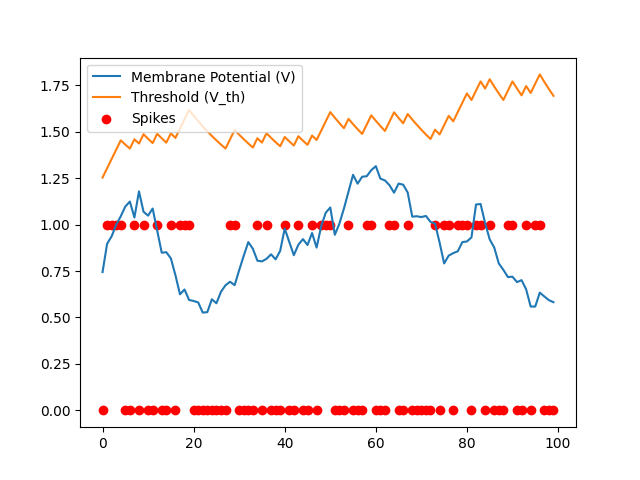
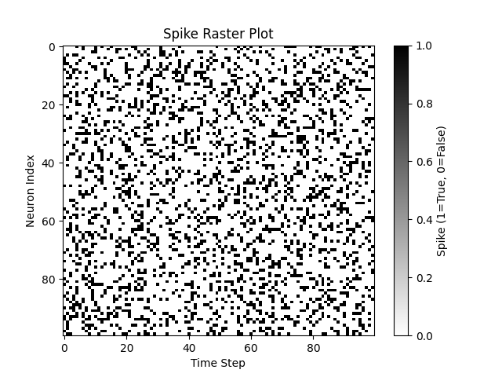
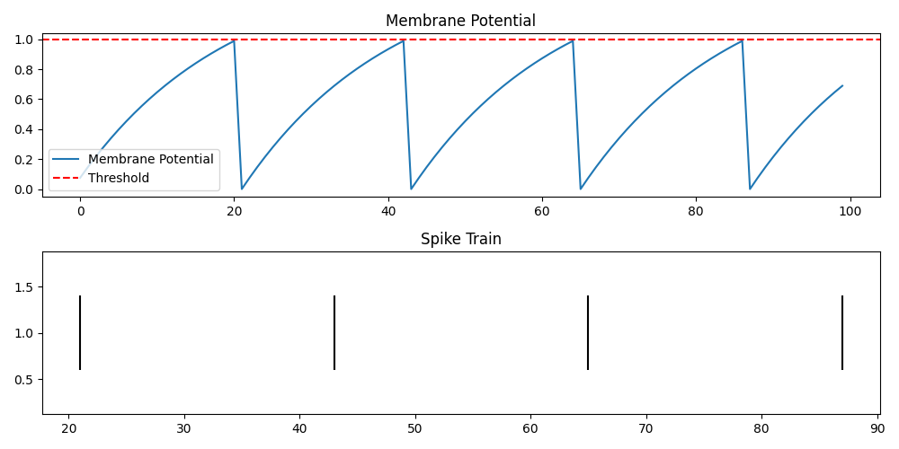
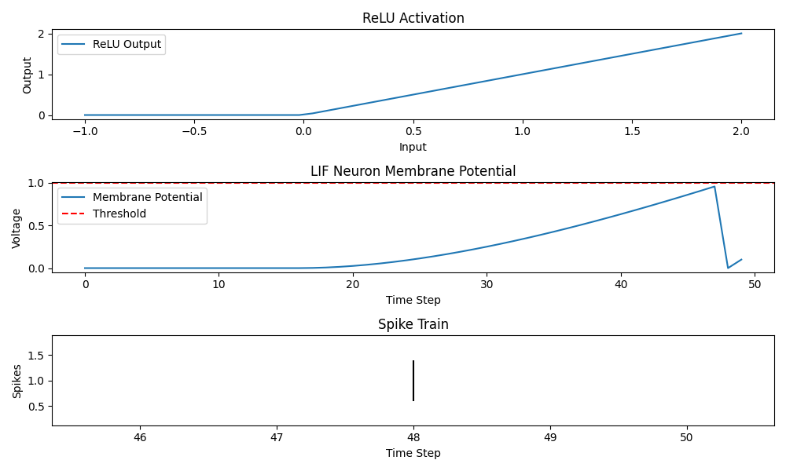
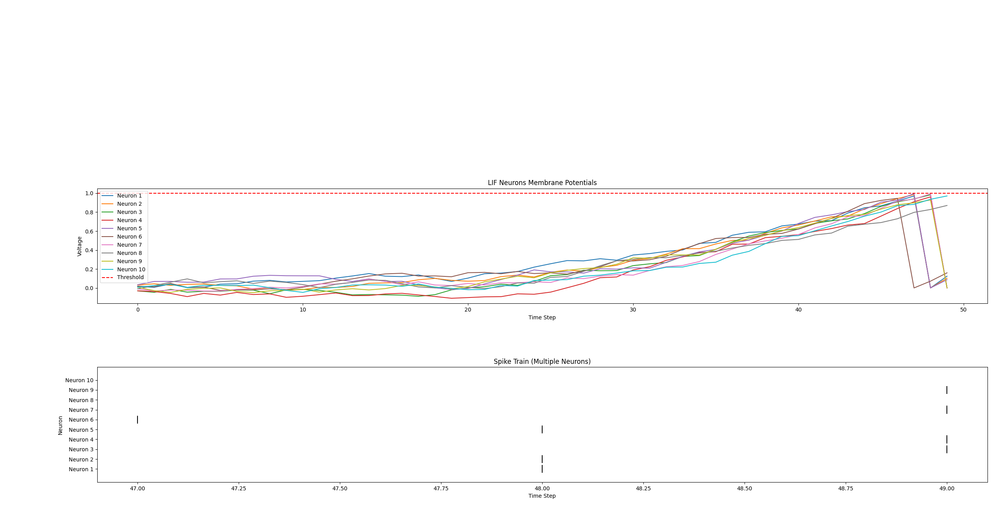
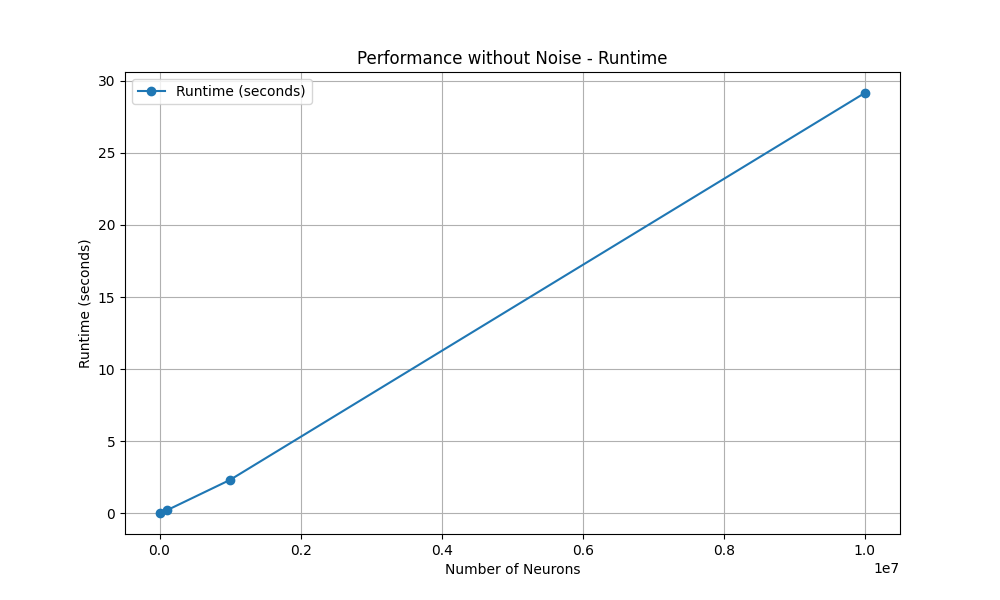
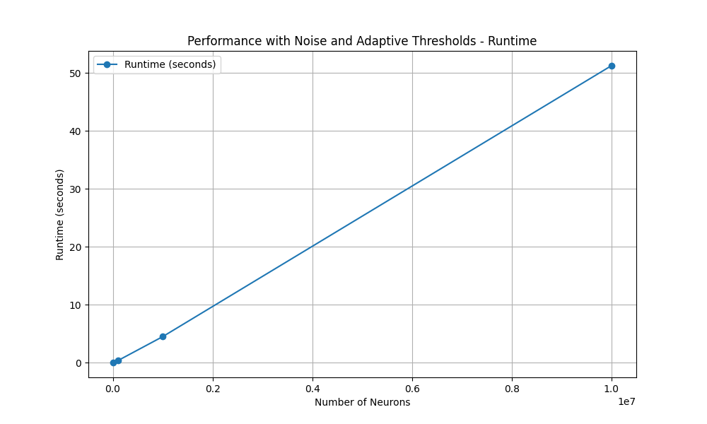
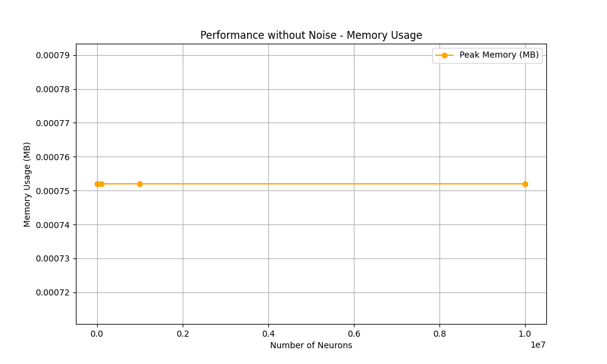
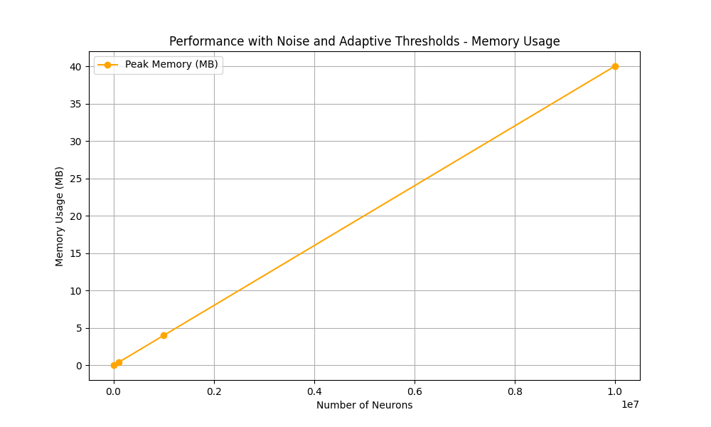

# LIF Neuron Simulation

### 🚀 Development Notes
> ⚡ I developed my own implementation of LIF neurons because the 
> norse library did not meet my specific requirements.
> I also implemented PyTorch-compatible layers for LIF neurons, 
> enabling their integration into neural network models.

---

This repository implements spiking neural networks using 
**Leaky Integrate-and-Fire (LIF)** neurons. The simulations 
include membrane potential tracking, spike generation, 
and a comparison of spiking behaviors between neuron types.

## Key Features
- Simulation of **LIF neurons** with voltage decay, threshold-based spiking, probabilistic spike generation, and membrane reset.
- Visualization of membrane potentials and spike trains for single and multiple neurons.
- PyTorch-compatible layers for integration into neural network models.

---

## Changelog
- **Noise Support:** Gaussian noise can now be added to the membrane potential, improving biological realism.
- **Adaptive Thresholds:** Thresholds increase dynamically after a spike and decay over time, with configurable limits using `min_threshold` and `max_threshold`.
- **Vectorized LIFNeuronGroup:** Efficient simulation of multiple neurons with parallel processing, supporting batch inputs.
- **PyTorch Integration:** Added `TorchLIFNeuronGroup` for seamless integration of vectorized neuron simulations into PyTorch models.

In the following images, you can see the threshold stochastic and LIF neuron group simulations with 100 neurons each:
<div align="center">
  
  
</div>

## Images and Explanation

### 1. **Basic LIF Neuron Simulation**
This figure shows the membrane potential of a single LIF neuron over time:



- **Top Plot**: Membrane potential of the LIF neuron. When the potential reaches the threshold (red dashed line), the neuron spikes, and the potential resets.
- **Bottom Plot**: Spike train. Each vertical line indicates a spike event.

### 2. **LIF Neuron with ReLU Activation**
Here, the input to the LIF neuron is passed through a ReLU activation layers:



- **Top Plot**: ReLU output as a function of input values. Negative values are clipped to 0.
- **Middle Plot**: Membrane potential of the LIF neuron. The potential accumulates input until it spikes.
- **Bottom Plot**: Spike train of the LIF neuron.

### 3. **Multiple LIF Neurons Simulation**
This simulation shows the behavior of 10 LIF neurons with slightly varying inputs:



- **Top Plot**: Membrane potentials of 10 neurons over time. Each neuron has its own dynamics.
- **Bottom Plot**: Spike train for all neurons. Each row corresponds to a neuron, with vertical lines marking spike events.

---

## How to Use

### Installation
Clone this repository and install the required dependencies:

```bash
pip install -r requirements.txt
pip install .
```

### PyTorch Integration
This repository also includes PyTorch-compatible layers for 
LIF neurons. Below is an example of using the 
LIFNeuronGroup class with PyTorch:

```python
import torch

from torch import nn
from layers.torch_layers import LIFLayer


class ExampleSNN(nn.Module):
    def __init__(self, input_neurons, hidden_neurons, output_neurons, timesteps, batch_size):
        super(ExampleSNN, self).__init__()
        self.timesteps = timesteps

        self.input_layer = LIFLayer(num_neurons=input_neurons, batch_size=batch_size)
        self.hidden_layer = LIFLayer(num_neurons=hidden_neurons, batch_size=batch_size)
        # ... Add more layers as needed
        self.input_to_hidden = nn.Linear(input_neurons, hidden_neurons)
        self.output_layer = nn.Linear(hidden_neurons, output_neurons)

    def forward(self, x):
        spikes = self.input_layer(x)
        spikes = spikes.sum(dim=0).float()
        spikes = self.input_to_hidden(spikes)
        spikes = self.hidden_layer(spikes.unsqueeze(0))

        spikes_sum = spikes.sum(dim=0).float()
        return self.output_layer(spikes_sum)

# Example Usage, assuming input is a tensor of shape (timesteps, batch_size, input_neurons)
if __name__ == "__main__":

    input_neurons = 100
    hidden_neurons = 50
    output_neurons = 10
    timesteps = 16
    batch_size = 10
    device = "cuda" if torch.cuda.is_available() else "cpu"
    
    input = torch.rand((timesteps, batch_size, input_neurons), device=device)
    
    model = ExampleSNN(input_neurons, hidden_neurons, output_neurons, timesteps, batch_size).to(device)
    output = model(input)
```
This example demonstrates how to set up and simulate spiking neural dynamics for multiple neurons in parallel, leveraging PyTorch for efficient computation.

---

## Performance Tests

I conducted performance tests to evaluate the scalability and efficiency of the `LIFNeuronGroup` implementation using PyTorch and batch processing. Below are the results:

### Results Summary
1. **Time Complexity**: The implementation exhibits a time complexity of \(O(n)\), where \(n\) is the number of neurons. This is optimal for simulating spiking neural networks, as each neuron requires updates for each timestep.
2. **Linear Scaling**: The runtime and memory usage scale linearly (Without noise it is constant) with the number of neurons, as shown in the plots below.
3. **Effect of Features**: Adding noise and adaptive thresholds maintains linear scaling.

### Runtime Scaling with Neuron Count

#### Performance Without Noise

<div align="center">
  
</div>

- Runtime increases linearly with the number of neurons, demonstrating efficient vectorized operations.

#### Performance With Noise and Adaptive Thresholds

<div align="center">
  
</div>

- Adding noise and adaptive thresholds increases the runtime slightly due to additional computations.

### Memory Usage Scaling

#### Performance Without Noise

<div align="center">
  
</div>

- The constant memory usage without noise is due to the absence of additional computational steps

#### Performance With Noise and Adaptive Thresholds

<div align="center">
  
</div>

- Memory usage remains manageable, even with additional features enabled.

---

## Acknowledgments
This project was developed to simulate and visualize spiking neural networks, combining classical LIF models with modern probabilistic approaches like.

---

## License
This project is licensed under the MIT License. Feel free to use and modify it for your research or personal projects.

