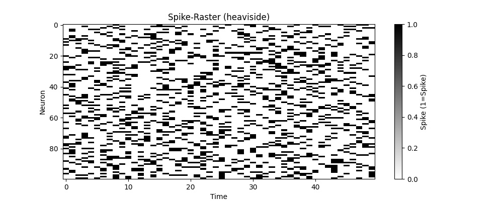
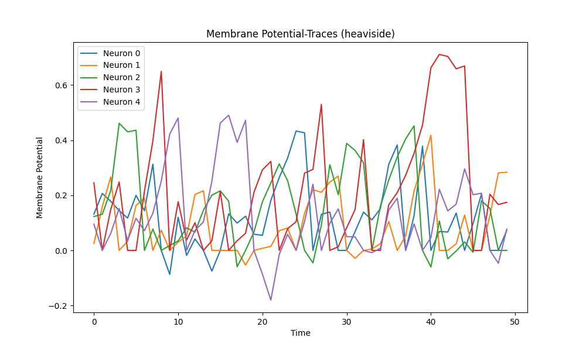
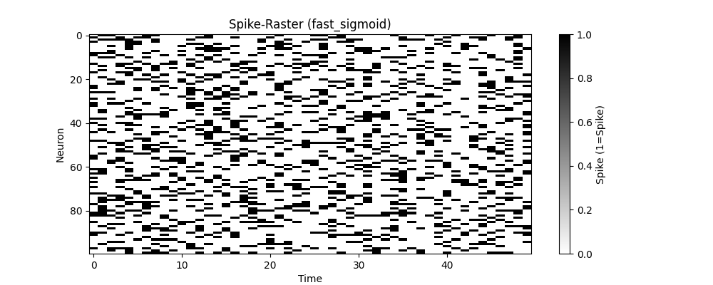
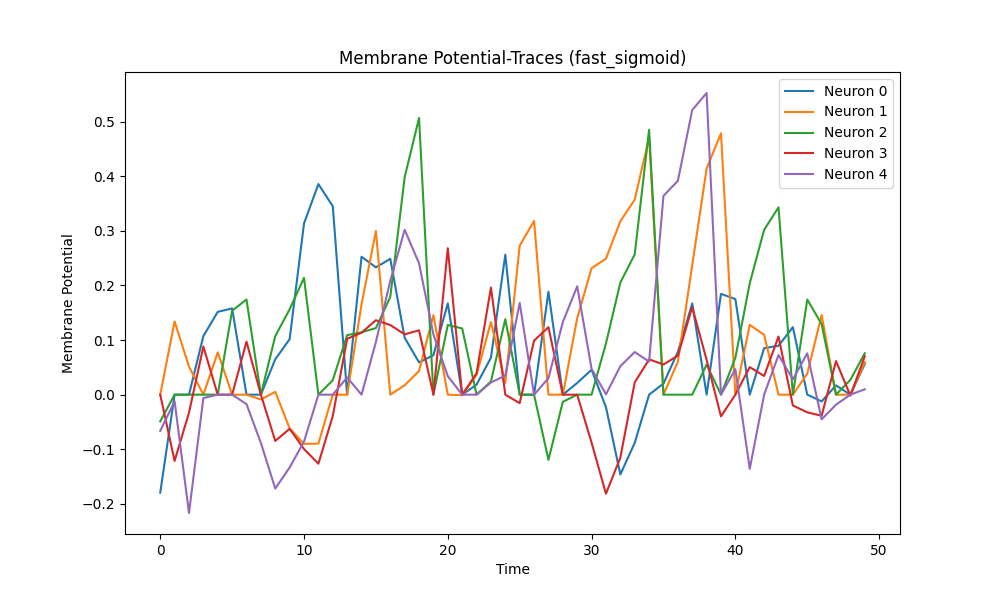
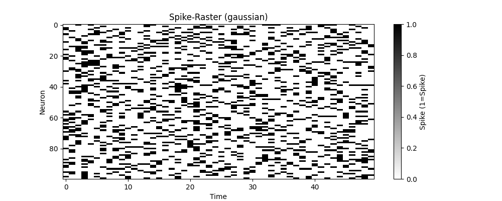
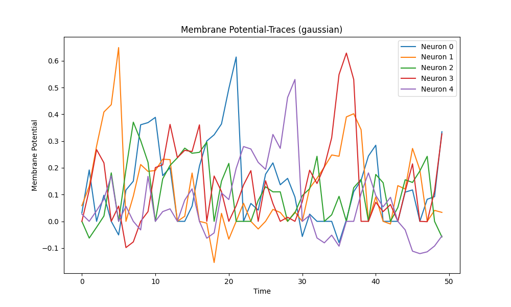
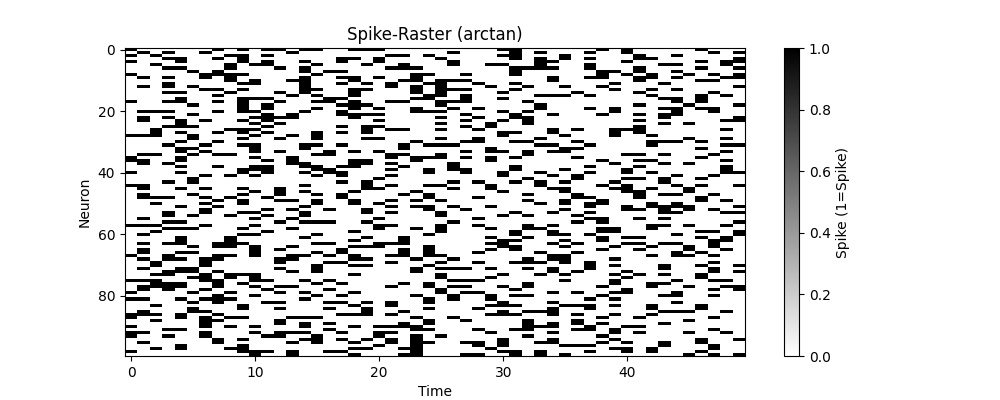
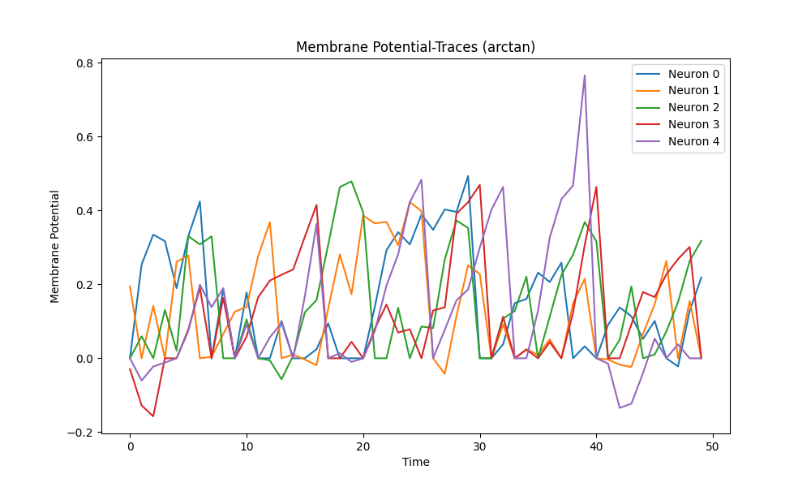

# Extended LIF Neuron

### 🚀 Development Notes
> ⚡ I developed my own implementation of LIF neurons because the 
> norse library did not meet my specific requirements.
> I also implemented PyTorch-compatible layers for LIF neurons, 
> enabling their integration into neural network models.

---

This repository implements **Leaky Integrate-and-Fire (LIF)** neurons. The simulations 
include membrane potential tracking, spike generation, 
and a comparison of spiking behaviors between neuron types.

# Overview
The LIFNeuronGroup is a spiking neuron model that integrates multiple biological features into its forward pass. It processes various inputs and internal states to produce realistic, dynamic spiking behavior. The model incorporates mechanisms such as membrane potential dynamics, adaptation, synaptic short-term plasticity, neuromodulation, and (optionally) dynamic spike probability. Below is a summary of what the neuron can process and how it works.

## Summary Table

| Feature                     | Description                                                                                         | Parameters / Inputs                                     |
|-----------------------------|-------------------------------------------------------------------------------------------------|------------------------------------------------------|
| **Input Current (I)**       | The raw external current driving the neuron.                                                     | Tensor of shape (batch_size, num_neurons).           |
| **External Modulation**     | An optional external signal (e.g., reward, error, dopamine-like signal) that modulates the neuron's excitability. It is processed through a user-supplied transformation function (neuromod_transform) or defaults to a sigmoid. | Tensor of shape broadcastable to (batch_size, num_neurons). |
| **Membrane Potential (V)**  | Represents the neuron's current voltage. Updated at each timestep based on the effective input. When a spike occurs, V is reset to V_reset. | Updated using the equation: `V += ((I_effective - V) / tau) * dt + noise/V_th`. |
| **Effective Input (I_effective)** | Combines the raw input with dynamic modulations: <br>• **Synaptic Efficiency**: Scales the input (models short-term plasticity).<br>• **Neuromodulator**: Adds context-dependent excitability.<br>• **Adaptation Current**: Subtracts to model refractoriness. | Computed as: `I_effective = I * synaptic_efficiency + neuromodulator - adaptation_current`. |
| **Synaptic Efficiency**     | Models short-term synaptic plasticity (depression and recovery). Depressed when a neuron spikes and recovers over time. | Updated via `depression_rate` (upon spiking) and `recovery_rate` (recovery toward 1). |
| **Adaptation Current**      | Simulates internal adaptation (e.g., due to ion concentration changes). Increases when the neuron spikes and decays over time, reducing excitability immediately after a spike. | Updated using `adaptation_decay` and `spike_increase`. |
| **Adaptive Threshold (V_th)** | The firing threshold that can adapt based on recent activity. It increases when the neuron spikes and decays back toward baseline otherwise. | Clamped between `min_threshold` and `max_threshold`; updated using `eta`. |
| **Spike Generation**        | Determines when the neuron fires. For a hard threshold, a spike is generated when `V - V_th >= 0`. In stochastic mode, a spike probability is computed (using either a static sigmoid or a dynamic spike probability module) and sampled. | Output is a binary spike tensor. Deterministic mode uses a hard threshold; stochastic mode uses probability. |
| **Dynamic Spike Probability** | Optionally computes the spike probability dynamically based on recent spike history, which results in variable excitability even for the same input. | Enabled by setting `allow_dynamic_spike_probability`; controlled by `base_alpha` and `tau_adapt`. |
| **Surrogate Gradient Function** | Used during training for backpropagation. Approximates the derivative of the non-differentiable spike activation function. Options include `heaviside`, `fast_sigmoid`, `gaussian`, and `arctan`. | Specified via `surrogate_gradient_function` and parameter `alpha`. |

## How It Works

### Input Processing
- **I (Input Current):** The neuron receives a raw current, which is the primary drive.
- **External Modulation:** Optionally, an external signal (e.g., representing a reward or dopamine level) is provided. This signal is transformed (using a user-defined `neuromod_transform` or a default sigmoid) to produce a modulation factor that influences neuronal excitability.

### Effective Input Calculation
The raw input is modified by internal dynamic factors:
- **Synaptic Efficiency:** Scales down the input if previous spikes have occurred (modeling synaptic depression).
- **Neuromodulator:** Adds a context-dependent boost (or reduction) to excitability.
- **Adaptation Current:** Subtracts from the input to account for refractory periods after spiking.

The effective input is computed as:
```math
I_{effective} = I * synaptic_{efficiency} + neuromodulator - adaptation_{current}
```

### Membrane Potential Update

- The neuron's membrane potential V is updated based on the effective input, time constant tau, and any noise (if stochastic mode is enabled).
- When V exceeds the adaptive threshold V_th, a spike is generated.
- In deterministic (non-stochastic) mode, a hard threshold is applied; in stochastic mode, a probability is computed (either static or dynamic) and a spike is sampled.

### Spike Generation & Reset

- If a spike occurs, V is reset to V_reset.
- The model then updates internal states:
- Adaptation Current: Increases for spiking neurons and decays over time.
- Synaptic Efficiency: Depresses upon spiking and recovers gradually.
- Adaptive Threshold (V_th): Adjusts (increases upon spiking and decays when inactive).

---

## Changelog
### v0.35
- **Dynamic forward pass:** `adaptation_current`, `synaptic_efficiency`, and `neuromodulator`.
  - **neuromod_transform:** A function or module that takes an external modulation tensor (e.g. reward/error signal)
    and returns a transformed tensor (e.g. modulation factors in [0,1]).
    If None, a default sigmoid transformation will be applied.

### v0.3
- **Surrogate Gradient:** Added surrogate gradient for backpropagation through time in LIF neurons, available as `surrogate_gradient_function` parameter `heaviside`, `fast_sigmoid`, `gaussian`, and `arctan`. Below are the spike raster and membrane potential plots for each surrogate gradient (`alpha` = 0.5):
<div align="center">
  
  
</div>
<div align="center">
  
  
</div>
<div align="center">
  
  
</div>
<div align="center">
  
  
</div>

- **Removed Single Neuron Simulation:** Removed the single neuron simulation in favor of the vectorized implementation.

### v0.2
- **Noise Support:** Gaussian noise can now be added to the membrane potential, improving biological realism.
- **Adaptive Thresholds:** Thresholds increase dynamically after a spike and decay over time, with configurable limits using `min_threshold` and `max_threshold`.
- **Vectorized LIFNeuronGroup:** Efficient simulation of multiple neurons with parallel processing, supporting batch inputs.
- **PyTorch Integration:** Added `TorchLIFNeuronGroup` for seamless integration of vectorized neuron simulations into PyTorch models.
In the following images, you can see the threshold stochastic and LIF neuron group simulations with 100 neurons each:
<div align="center">
  
  
</div>

## Images and Explanation

### 1. **Basic LIF Neuron Simulation**
This figure shows the membrane potential of a single LIF neuron over time:


- **Top Plot**: Membrane potential of the LIF neuron. When the potential reaches the threshold (red dashed line), the neuron spikes, and the potential resets.
- **Bottom Plot**: Spike train. Each vertical line indicates a spike event.

### 2. **LIF Neuron with ReLU Activation**
Here, the input to the LIF neuron is passed through a ReLU activation layers:


- **Top Plot**: ReLU output as a function of input values. Negative values are clipped to 0.
- **Middle Plot**: Membrane potential of the LIF neuron. The potential accumulates input until it spikes.
- **Bottom Plot**: Spike train of the LIF neuron.

### 3. **Multiple LIF Neurons Simulation**
This simulation shows the behavior of 10 LIF neurons with slightly varying inputs:


- **Top Plot**: Membrane potentials of 10 neurons over time. Each neuron has its own dynamics.
- **Bottom Plot**: Spike train for all neurons. Each row corresponds to a neuron, with vertical lines marking spike events.

---

## How to Use

### Installation
Clone this repository and install the required dependencies:

```bash
pip install -r requirements.txt
pip install -e .
```

### PyTorch Integration
This repository also includes PyTorch-compatible layers for 
LIF neurons. Below is an example of using the 
LIFNeuronGroup class with PyTorch:

```python
import torch

from torch import nn
from layers.torch_layers import LIFLayer


class ExampleSNN(nn.Module):
    def __init__(self, input_neurons, hidden_neurons, output_neurons, timesteps, batch_size):
        super(ExampleSNN, self).__init__()
        self.timesteps = timesteps

        self.input_layer = LIFLayer(num_neurons=input_neurons, batch_size=batch_size)
        self.hidden_layer = LIFLayer(num_neurons=hidden_neurons, batch_size=batch_size)
        # ... Add more layers as needed
        self.input_to_hidden = nn.Linear(input_neurons, hidden_neurons)
        self.output_layer = nn.Linear(hidden_neurons, output_neurons)

    def forward(self, x):
        spikes = self.input_layer(x)
        spikes = spikes.sum(dim=0).float()
        spikes = self.input_to_hidden(spikes)
        spikes = self.hidden_layer(spikes.unsqueeze(0))

        spikes_sum = spikes.sum(dim=0).float()
        return self.output_layer(spikes_sum)

# Example Usage, assuming input is a tensor of shape (timesteps, batch_size, input_neurons)
if __name__ == "__main__":

    input_neurons = 100
    hidden_neurons = 50
    output_neurons = 10
    timesteps = 16
    batch_size = 10
    device = "cuda" if torch.cuda.is_available() else "cpu"
    
    input = torch.rand((timesteps, batch_size, input_neurons), device=device)
    
    model = ExampleSNN(input_neurons, hidden_neurons, output_neurons, timesteps, batch_size).to(device)
    output = model(input)
```
This example demonstrates how to set up and simulate spiking neural dynamics for multiple neurons in parallel, leveraging PyTorch for efficient computation.

---

## Performance Tests

I conducted performance tests to evaluate the scalability and efficiency of the `LIFNeuronGroup` implementation using PyTorch and batch processing. Below are the results:

### Results Summary
1. **Time Complexity**: The implementation exhibits a time complexity of \(O(n)\), where \(n\) is the number of neurons. This is optimal for simulating spiking neural networks, as each neuron requires updates for each timestep.
2. **Linear Scaling**: The runtime and memory usage scale linearly (Without noise it is constant) with the number of neurons, as shown in the plots below.
3. **Effect of Features**: Adding noise and adaptive thresholds maintains linear scaling.

### Runtime Scaling with Neuron Count

#### Performance Without Noise

<div align="center">
  
</div>

- Runtime increases linearly with the number of neurons, demonstrating efficient vectorized operations.

#### Performance With Noise and Adaptive Thresholds

<div align="center">
  
</div>

- Adding noise and adaptive thresholds increases the runtime slightly due to additional computations.

### Memory Usage Scaling

#### Performance Without Noise

<div align="center">
  
</div>

- The constant memory usage without noise is due to the absence of additional computational steps

#### Performance With Noise and Adaptive Thresholds

<div align="center">
  
</div>

- Memory usage remains manageable, even with additional features enabled.

---

## Acknowledgments
This project was developed to simulate and visualize spiking neural networks, combining classical LIF models with modern probabilistic approaches like.

---

## License
This project is licensed under the MIT License. Feel free to use and modify it for your research or personal projects.

