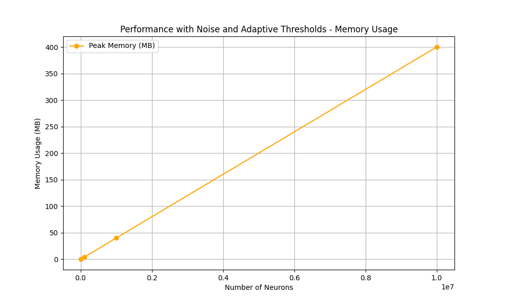

# LIF and Bernoulli Neuron Simulation

> I developed my own implementation of LIF neurons because the 
> norse library did not meet my specific requirements. 
> Additionally, I created Bernoulli neurons, which are a 
> probabilistic spiking neuron model, and extended LIF 
> neurons to support probabilistic behavior in the latest update. 
> I also implemented PyTorch-compatible layers for LIF neurons, 
> enabling their integration into neural network models.

This repository implements spiking neural networks using **Leaky Integrate-and-Fire (LIF)** neurons and **Autoregressive Bernoulli Spiking** neurons. The simulations include membrane potential tracking, spike generation, and a comparison of spiking behaviors between neuron types.

## Key Features
- Simulation of **LIF neurons** with voltage decay, threshold-based spiking, and membrane reset.
- **Autoregressive Bernoulli Spike Sampling (ABSS)** for probabilistic spike generation.
- Visualization of membrane potentials and spike trains for single and multiple neurons.
- PyTorch-compatible layers for integration into neural network models.

---

## Changelog
- **Noise Support:** Gaussian noise can now be added to the membrane potential, improving biological realism.
- **Adaptive Thresholds:** Thresholds increase dynamically after a spike and decay over time, with configurable limits using `min_threshold` and `max_threshold`.
- **Vectorized LIFNeuronGroup:** Efficient simulation of multiple neurons with parallel processing, supporting batch inputs.
- **PyTorch Integration:** Added `TorchLIFNeuronGroup` for seamless integration of vectorized neuron simulations into PyTorch models.

In the following images, you can see the threshold stochastic and LIF neuron group simulations with 100 neurons each:
<div align="center">
  
  
</div>

## Images and Explanation

### 1. **Basic LIF Neuron Simulation**
This figure shows the membrane potential of a single LIF neuron over time:


- **Top Plot**: Membrane potential of the LIF neuron. When the potential reaches the threshold (red dashed line), the neuron spikes, and the potential resets.
- **Bottom Plot**: Spike train. Each vertical line indicates a spike event.

### 2. **LIF Neuron with ReLU Activation**
Here, the input to the LIF neuron is passed through a ReLU activation layer:


- **Top Plot**: ReLU output as a function of input values. Negative values are clipped to 0.
- **Middle Plot**: Membrane potential of the LIF neuron. The potential accumulates input until it spikes.
- **Bottom Plot**: Spike train of the LIF neuron.

### 3. **Multiple LIF Neurons Simulation**
This simulation shows the behavior of 10 LIF neurons with slightly varying inputs:


- **Top Plot**: Membrane potentials of 10 neurons over time. Each neuron has its own dynamics.
- **Bottom Plot**: Spike train for all neurons. Each row corresponds to a neuron, with vertical lines marking spike events.

### 4. **Autoregressive Bernoulli Spiking Neurons (ABSS)**
This plot shows the behavior of 10 ABSS neurons:


- **Top Plot**: Membrane potentials of Bernoulli neurons. The potentials fluctuate based on input and autoregressive feedback.
- **Bottom Plot**: Spike train for the Bernoulli neurons. Spike probabilities are sampled from a Bernoulli distribution.

### 5. **Comparison of LIF and Bernoulli Neurons**
This combined visualization compares the spike trains of LIF and Bernoulli neurons:


- **Top Plot**: ReLU activation.
- **Second Plot**: Membrane potentials of LIF neurons.
- **Third Plot**: Membrane potentials of Bernoulli neurons.
- **Bottom Plot**: Spike trains of LIF and Bernoulli neurons, highlighting their differences.

---

## How to Use

### Installation
Clone this repository and install the required dependencies:

```bash
pip install -r requirements.txt
pip install .
```

### PyTorch Integration
This repository also includes PyTorch-compatible layers for LIF and Bernoulli neurons. You can use these layers in your neural networks:

```python
import torch

from snn_neurons.torch_layers import TorchLIFLayer, TorchBernoulliLayer

# Example
lif_layer = TorchLIFLayer(num_neurons=10)
bernoulli_layer = TorchBernoulliLayer(num_neurons=10)

# Forward pass
input_tensor = torch.rand(2, 10)  # Batch size 2, 10 neurons
lif_spikes = lif_layer(input_tensor)
bernoulli_spikes = bernoulli_layer(input_tensor)
```

---

## Performance Tests

We conducted performance tests to evaluate the scalability and efficiency of the `LIFNeuronGroup` implementation using PyTorch and batch processing. Below are the results:

### Results Summary
1. **Time Complexity**: The implementation exhibits a time complexity of \(O(n)\), where \(n\) is the number of neurons. This is optimal for simulating spiking neural networks, as each neuron requires updates for each timestep.
2. **Linear Scaling**: The runtime and memory usage scale linearly (Without noise it is constant) with the number of neurons, as shown in the plots below.
3. **Effect of Features**: Adding noise and adaptive thresholds introduces slight overhead but maintains linear scaling.

### Runtime Scaling with Neuron Count

#### Performance Without Noise

<div align="center">
  
</div>

- Runtime increases linearly with the number of neurons, demonstrating efficient vectorized operations.

#### Performance With Noise and Adaptive Thresholds

<div align="center">
  
</div>

- Adding noise and adaptive thresholds increases the runtime slightly due to additional computations.

### Memory Usage Scaling

#### Performance Without Noise

<div align="center">
  
</div>

- The constant memory usage without noise is due to the absence of additional computational steps

#### Performance With Noise and Adaptive Thresholds

<div align="center">
  
</div>

- Memory usage remains manageable, even with additional features enabled.
- 
---

## Acknowledgments
This project was developed to simulate and visualize spiking neural networks, combining classical LIF models with modern probabilistic approaches like ABSS.

---

## License
This project is licensed under the MIT License. Feel free to use and modify it for your research or personal projects.

