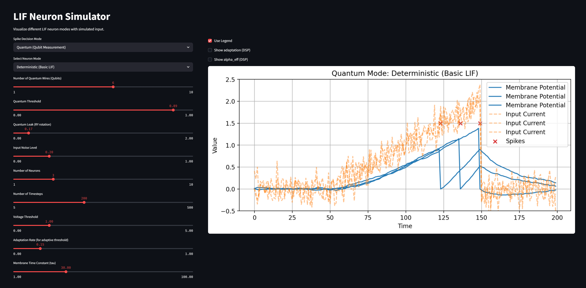

# QLIF Neurons

[](https://streamlit.io/)
[](https://pytorch.org/)
[](https://pennylane.ai/)
[](https://www.python.org/)
[](LICENSE)

### Development Notes

> **Quantum-inspired Leaky Integrate-and-Fire (QLIF) neurons for PyTorch.**  
Adaptive thresholds, dynamic spike probabilities, short-term synaptic plasticity, 
> neuromodulation, plus an optional 
> **qubit-based spike decision** that yields a differentiable, probabilistic spiking mechanism grounded in a 1-qubit model.

---

## Quickstart

### Install
#### Via clone and pip
```bash
git clone https://github.com/DanjelPiDev/QLIF-Neurons.git
cd QLIF-Neurons
# install dependencies
pip install -r requirements.txt
```

#### Or directly via pip
```bash
pip install git+https://github.com/DanjelPiDev/QLIF-Neurons.git
```

---

### Streamlit Demo
Run the Streamlit demo to visualize neuron activity and parameters:
```bash
streamlit run src/lif_streamlit_dashboard.py
```


<div align="center">
  
  
</div>

---

### Minimal Example
Here's a minimal example of using the QLIF neuron layer in PyTorch:
```python
import torch
from qlif_layers.qlif_layer import QLIFLayer

# (T, B, N)
T, B, N = 100, 1, 128
inp = torch.randn(T, B, N)

layer = QLIFLayer(
    num_neurons=N,
    V_th=1.5,
    tau=30.0,
    stochastic=True,
    noise_std=0.05,
    use_adaptive_threshold=True,
    quantum_mode=True,           # default is True to enable QLIF (qubit-based)
).to("cpu")                      # or "cuda" for GPU

spikes, voltages = layer(inp)    # spikes: (T,B,N) bool / voltages: (T,B,N) float
```

---

## Overview

In classical LIF neurons, spike decisions are 
either **deterministic** (hard threshold) or **pseudo-stochastic** through additive noise.  
**QLIF** replaces this thresholding step with a **single-qubit–based mapping**:

### Key features include:

- **Adaptive Thresholds** (refractory/homeostasis)
- **Neuromodulation** (`gain`, `threshold-shift`, `prob-slope`)
- **Short-term Plasticity** (depression/recovery)
- **Dynamic Spike Probability** (self-limiting)
- **QLIF Mode** (qubit-inspired spike decision)

This framework not only allows for comprehensive simulations and comparisons of spiking behaviors across 
different neuron types but also facilitates the integration of biologically inspired and quantum-inspired 
dynamics into modern machine learning workflows.

### Parameters

| Parameter	                           | Default	     | Description                                                                                                                                                                                           |
|--------------------------------------|--------------|-------------------------------------------------------------------------------------------------------------------------------------------------------------------------------------------------------|
| `num_neurons`	                       | `required`	  | Number of neurons in the group.                                                                                                                                                                       |
| `V_th`	                              | 1.0	         | Initial threshold voltage for all neurons.                                                                                                                                                            |
| ``V_reset``	                         | 0.0	         | Voltage to which the membrane potential is reset after a spike.                                                                                                                                       |
| ``tau``	                             | 20.0	        | Membrane time constant that controls the decay rate of the membrane potential.                                                                                                                        |
| ``dt``	                              | 1.0	         | Time step used for updating the membrane potential.                                                                                                                                                   |
| ``eta``	                             | 0.1	         | Adaptation rate for the threshold voltage (used in adaptive threshold updating).                                                                                                                      |
| ``use_adaptive_threshold``	          | True	        | If set to true, the threshold will adapt based on recent spiking activity.                                                                                                                            |
| ``noise_std``	                       | 0.1	         | Standard deviation of the Gaussian noise added to the membrane potential (used if stochastic firing is enabled).                                                                                      |
| ``stochastic``	                      | True	        | Enables stochastic firing. In stochastic mode, spikes are sampled based on a computed spike probability.                                                                                              |
| ``min_threshold``	                   | 0.5	         | Minimum allowable value for the threshold voltage.                                                                                                                                                    |
| ``max_threshold``	                   | 2.0	         | Maximum allowable value for the threshold voltage.                                                                                                                                                    |
| ``batch_size``	                      | 1	           | Batch size for input data processing.                                                                                                                                                                 |
| ``device``	                          | `cpu`	       | Device to run the simulation on (either `cpu` or `cuda`).                                                                                                                                             |
| ``surrogate_gradient_function``	     | `heaviside`	 | Name of the surrogate gradient function for backpropagation. Options include `heaviside`, `fast_sigmoid`, `gaussian`, and `arctan`.                                                                   |
| ``alpha``	                           | 1.0	         | Parameter for the surrogate gradient function.                                                                                                                                                        |
| ``allow_dynamic_spike_probability``	 | True	        | If true, enables dynamic spike probability computation that uses previous spike history (acts as a self-locking mechanism).                                                                           |
| ``base_alpha``	                      | 2.0	         | Base alpha value for the dynamic sigmoid function used in dynamic spike probability.                                                                                                                  |
| ``tau_adapt``	                       | 20.0	        | Time constant for the adaptation in the dynamic spike probability mechanism.                                                                                                                          |
| ``adaptation_decay``	                | 0.9	         | Decay rate for the adaptation current (how quickly the adaptation effect decays over time).                                                                                                           |
| ``spike_increase``	                  | 0.5	         | Increment added to the adaptation current each time a neuron spikes.                                                                                                                                  |
| ``depression_rate``	                 | 0.1	         | Rate at which synaptic efficiency is reduced (depressed) when a neuron spikes.                                                                                                                        |
| ``recovery_rate``	                   | 0.05	        | Rate at which synaptic efficiency recovers toward its baseline (typically 1) after being depressed.                                                                                                   |
| ``neuromod_transform``	              | None	        | A function or module that transforms an external modulation tensor (e.g. reward or error signal) into modulation factors (typically in [0, 1]). If None, a default sigmoid transformation is applied. |
| ``neuromod_mode``	                  | `gain`	      | Mode for neuromodulation. Options include `gain`, `prob_slope`, `threshold`, and (`off` or `None`).                                                                                                   |
| ``learnable_threshold``	             | `True`	      | If true, the threshold voltage is learnable and can be updated during training.                                                                                                                       |
| ``learnable_tau``	                    | `False`	     | If true, the membrane time constant tau is learnable and can be updated during training.                                                                                                              |
| ``learnable_eta``	                    | `False`	     | If true, the adaptation rate eta is learnable and can be updated during training.                                                                                                                     |
| ``learnable_qscale`` | `True`       | If true, the quantum scale factor (q_scale) is learnable and can be updated during training.                                                                                                          |
| ``learnable_qbias``  | `True`       | If true, the quantum bias (q_bias) is learnable and can be updated during training.                                                                                                                   |
| ``quantum_mode``	                  | `True`	      | If true, enables quantum mode for spike generation using PennyLane. In this mode, spikes are generated based on quantum circuit measurements (Qubits, RY gates).                                      |
| ``quantum_wire`` | 4            | Number of Qubits (wires) used per neuron (each neuron can use its own quantum circuit if desired).                                                                                                    |
| ``quantum_threshold`` | 0.7          | Quantum decision threshold (as cos(theta)): lower values = more selective, higher = more spikes.                                                                                                      |
| ``quantum_leak`` | 0.1          | Quantum leak, applied as an RY rotation after each update (emulates biological leak in quantum state).                                                                                                |

*All standard LIF parameters like V_th, tau, noise_std, etc. are still supported and work identically in quantum mode.*

### How It Works

#### Classic vs. Quantum Spike Generation

- **Classic Mode**: Spike is generated by crossing a voltage threshold, optionally with noise or adaptive dynamics.

- **Quantum Mode**: Each neuron's membrane potential is encoded as a quantum rotation (RY(V)), plus a "leak" rotation, and the spike is triggered if the measured Qubit is below a tunable quantum threshold.
This introduces a true quantum-inspired, probabilistic decision process.

#### Input Processing

- **I (Input Current):** The neuron receives a raw current, which is the primary drive.
- **External Modulation:** Optionally, an external signal (e.g., representing a reward or dopamine level) is provided.
  This signal is transformed (using a user-defined `neuromod_transform` or a default sigmoid) to produce a modulation
  factor that influences neuronal excitability.

#### Effective Input Calculation

The raw input is modified by internal dynamic factors:

- **Synaptic Efficiency:** Scales down the input if previous spikes have occurred (modeling synaptic depression).
- **Neuromodulator:** Adds a context-dependent boost (or reduction) to excitability.
- **Adaptation Current:** Subtracts from the input to account for refractory periods after spiking.

The effective input is computed as:

```math
I_{effective} = I * synaptic_{efficiency} + neuromodulator - adaptation_{current}
```

#### Membrane Potential Update

- The neuron's membrane potential ``V`` is updated based on the effective input, time constant tau, and any noise (if
  stochastic mode is enabled).
- When ``V`` exceeds the adaptive threshold ``V_th``, a spike is generated.
- In deterministic (non-stochastic) mode, a hard threshold is applied; in stochastic mode, a probability is computed (
  either static or dynamic) and a spike is sampled.

#### Spike Generation & Reset

- If a spike occurs, ``V`` is reset to ``V_reset``.
- The model then updates internal states:
- Adaptation Current: Increases for spiking neurons and decays over time.
- Synaptic Efficiency: Depresses upon spiking and recovers gradually.
- Adaptive Threshold (``V_th``): Adjusts (increases upon spiking and decays when inactive).

---

## Quantum Mode, Theory, Mapping & Calibration

This project implements a **qubit-inspired spike generator** for LIF neurons.  
The goal is a **differentiable, calibrated, and vectorized** probabilistic spike mechanism that can be trained end-to-end, while being grounded in a simple quantum circuit model.

### 1) One-Qubit Circuit (what we actually compute)

I use a single qubit with a rotation about the Y axis and measure `Z`:

```
prepare |0> --RY(θ)--> measure Z
```

The probability of measuring `|1>` is:

```
p(|1>) = sin²(θ/2) = 0.5 * (1 - cos θ)
```

### 2) Mapping the membrane gap Δ to θ

Then map the neuron's **membrane gap**:

```
Δ = V - V_th
```

and map it linearly to the rotation angle:

```
θ = α · Δ + β
p = 0.5 * (1 - cos θ)
```
- **α = q_scale** (learnable if `learnable_qscale=True`)
- **β = q_bias; quantum_leak** (learnable if `learnable_qbias=True`)

This is computed in `_quantum_prob` using the shared helper `q_spike_prob(Δ, α, β)`.  
The mapping is **periodic** in Δ because of the cosine, this is intentional here and 
matches the original 1-qubit model. If strict monotonicity 
is desired, a squashing function (e.g. sigmoid) can be applied 
before scaling θ (not used in the current default).

---

### 3) Why monotonic mapping?

Instead of adjusting `V_th` to control base firing rates, we calibrate α and β directly so that:

- **Baseline firing probability** at Δ = 0 matches a target `p₀` (e.g. 0.02)
- **Local slope** `s₀ = (∂p/∂Δ)|Δ=0` matches a target value (e.g. 0.10)

```
p(Δ) = 0.5 * (1 - cos(αΔ + β))
```
```
β = arccos(1 - 2p₀)
α = (2 · s₀) / sin(β)
```
In code (`init_quantum`):
```python
eps = 1e-6
beta = torch.acos(torch.clamp(1.0 - 2.0 * torch.tensor(p0), -1.0 + eps, 1.0 - eps))
alpha = (2.0 * torch.tensor(slope0)) / torch.clamp(torch.sin(beta), min=eps)

with torch.no_grad():
  self.q_bias.fill_(float(beta + self.quantum_leak))
  self.q_scale.fill_(float(alpha))
```

---

#### Results

<div align="center">
    
    <p>Figure 2: Example of LIF Neuron Activity (Different Modes)</p>
</div>

---

### License

This project is licensed under the MIT License. Feel free to use and modify it for your research or personal projects.

